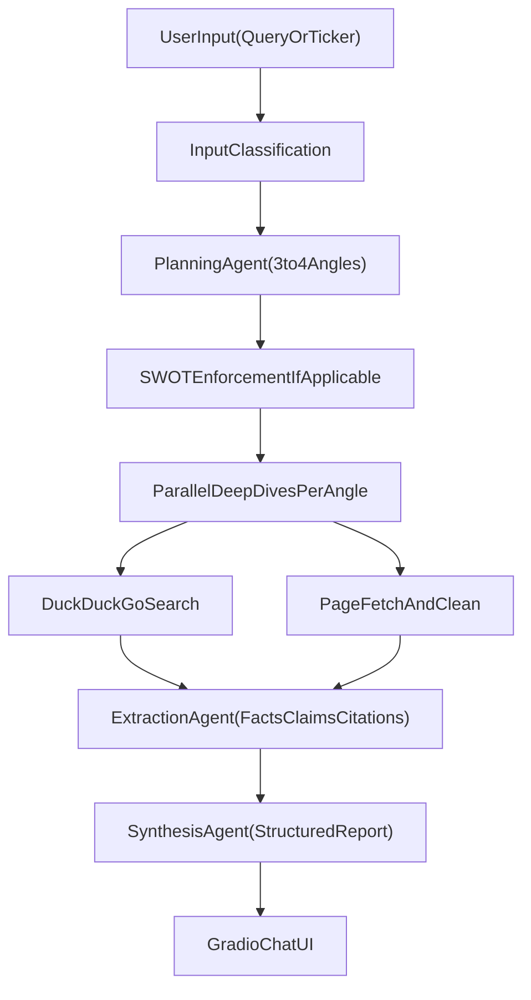

# Pydantic Deep Research Agent

This is an advanced AI agent built with Pydantic AI using the `gpt-5-mini` model from OpenAI. It performs deep, multi-step research on any topic or stock ticker, synthesizing information from multiple web searches into a detailed report.

## Features

-   **Deep Research**: Takes a query or stock ticker (e.g., "Volkswagen") and generates a comprehensive report.
-   **Multi-Step Process**:
    1.  **Planning**: Analyzes the request to identify key research angles.
    2.  **Parallel Execution**: Searches DuckDuckGo and scrapes web pages for each angle in parallel.
    3.  **Synthesis**: Compiles facts, claims, and citations into a structured Markdown report.
-   **Gradio Interface**: A clean web UI to interact with the agent.

## Architecture (Multi-Step Workflow)

The Deep Research Agent follows this pipeline for every query:

1.  **Input Classification**
    - Detects whether the input is likely a stock ticker (e.g., `Volkswagen`) or a general research question.
    - For ticker/company-like inputs, it resolves topic context and enforces a `SWOT analysis` angle.

2.  **Planning Agent**
    - Creates a structured research plan with 3-4 non-overlapping angles.
    - Example angles: SWOT, recent performance, competitive positioning, guidance/outlook.

3.  **Parallel Deep Dives**
    - For each angle, the system:
      - runs a DuckDuckGo search,
      - collects result metadata (`title`, `url`, `snippet`),
      - fetches page content for top sources where possible.
    - Angle research runs concurrently to reduce total runtime.

4.  **Extraction Agent**
    - Processes each angle’s source set.
    - Extracts key facts, numbers, and claims.
    - Associates findings with supporting sources (citations).

5.  **Synthesis Agent**
    - Merges all angle outputs into one report.
    - Produces:
      - Executive summary
      - Findings by research angle
      - Evidence bullets with citations
      - Risks/uncertainties and conflicting information
      - What-to-watch-next checklist

6.  **Gradio Delivery**
    - Returns the final structured Markdown report in the chat UI.



## Prerequisites

-   Python 3.10 or higher
-   OpenAI API Key

## Setup Guide (Windows)

Follow these steps to set up the project on Windows.

### 1. Create a Virtual Environment

Open your terminal (PowerShell, Command Prompt, or Git Bash) in the project folder and run the command for your shell:

**Option A: PowerShell or Command Prompt**
```powershell
python -m venv venv
.\venv\Scripts\activate
```

**Option B: Git Bash**
```bash
python -m venv venv
source venv/Scripts/activate
```

*You should see `(venv)` appear at the start of your command prompt line, indicating the environment is active.*

### 2. Install Dependencies

Run this command to install the required libraries:

```bash
pip install -r requirements.txt
```

### 3. Configure API Key

1.  Open the file named `.env` in your code editor.
2.  Paste your OpenAI API key after the equals sign. It should look like this:

```env
OPENAI_API_KEY=<enter your openai_API_KEY here>
```

*Note: Do not add quotes or spaces around the key.*

## Running the Agent

Start the application by running:

```bash
python agent.py
```

After a few seconds, you will see a local URL (usually `http://127.0.0.1:7860`).
**Ctrl+Click** the link or copy-paste it into your browser to open the chat interface.

## Project Structure

```text
Padantic/
├── agent.py
├── requirements.txt
├── .env
├── .gitignore
└── README.md
```

- `agent.py` - Main application file (agents, tools, orchestration, and Gradio UI).
- `requirements.txt` - Python dependency list for the project.
- `.env` - Local environment variables (`OPENAI_API_KEY`).
- `.gitignore` - Files/folders excluded from version control (e.g., `venv/`, `.env`).
- `README.md` - Setup guide, architecture, and usage documentation.

## Troubleshooting

**"No such file or directory" / Long Path Error:**
If you see an error about "Long Path support" or missing files during installation:
1.  We are using `pydantic-ai-slim` to minimize this issue.
2.  If it persists, enable Long Paths on Windows:
    -   Open **PowerShell** as **Administrator**.
    -   Run:
        ```powershell
        New-ItemProperty -Path "HKLM:\SYSTEM\CurrentControlSet\Control\FileSystem" -Name "LongPathsEnabled" -Value 1 -PropertyType DWORD -Force
        ```
    -   Restart your computer.

**"Script is disabled" error in PowerShell:**
If `activate` fails, run this command in PowerShell to allow scripts:
```powershell
Set-ExecutionPolicy -ExecutionPolicy RemoteSigned -Scope CurrentUser
```
Then try activating again.
